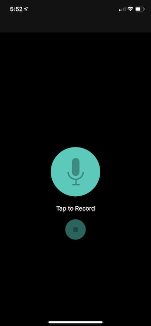
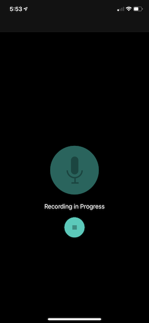
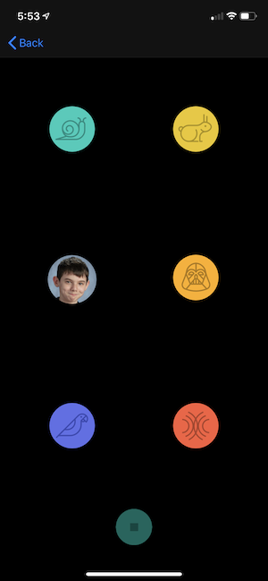

. 

# PitchPerfect
The Pitch Perfect app was created to specification for my final project in the Intro to iOS Development with Swift course as a part of my iOS Developer Nanodegree from Udacity. Pitch Perfect is an app that allows you to record your voice and then play it back modulated to sound slow (snail), fast (rabbit), high pitch (chipmunk/my son :) ), deep (darth vader), echo, or reverb. This assignment was focust around basic coding and UI Design (I did not create the files that modulate the sound).

## Screenshots
| Home Screen: Idle | Home Screen: Recording | Play Sounds Screen |
| ----------------- | ---------------------- | ------------------ |
|  |  | 

## Frameworks Used
1. [Foundation](https://developer.apple.com/documentation/foundation)
2. [UIKit](https://developer.apple.com/documentation/uikit)
3. [AVFoundation](https://developer.apple.com/documentation/avfoundation)

## Instructions

### Home Screen:
- Tap the microphone to record your voice
- Tap the stop button to stop recording and goto the Play Sounds screen

### Play Sounds Screen:
- Tap on one of the icons to hear your voice played back to match one of the symbols
